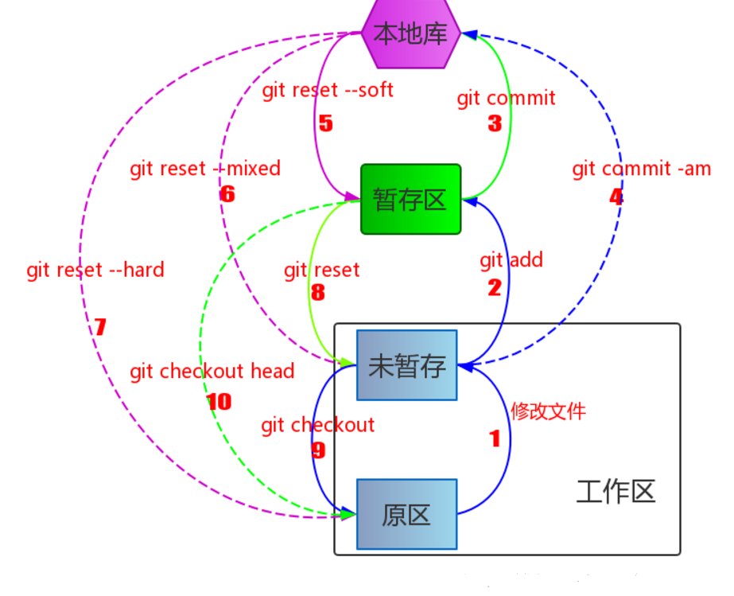
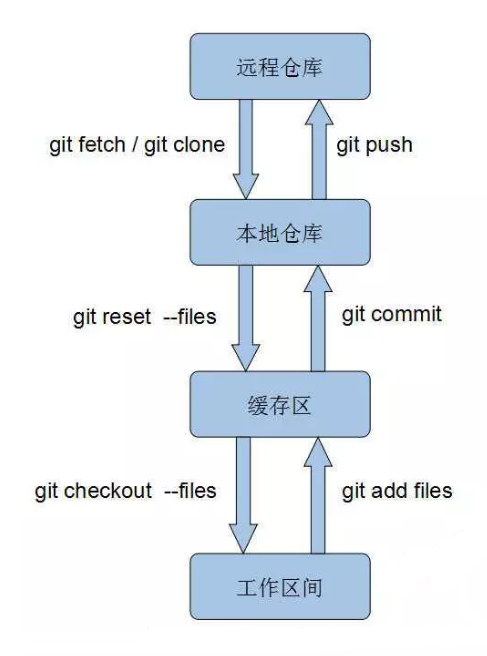

###### Git总工作流程

- 要明白这3个概念，工作区（**working tree**），暂存区（**index /stage**），本地仓库（**repository**）
- git跟不同的参数，比较不同的区间的版本。

1. git diff：是查看working tree与index的差别的。
2. git diff --cached：是查看index与repository的差别的。
3. git diff HEAD：是查看working tree和repository的差别的。其中：HEAD代表的是最近的一次commit的信息。

 **综上所述：git diff 后面跟文件名称是是查看工作区（working tree）与暂存区（index）的差别的。**

###### 常用命令

   mkdir：         XX (创建一个空目录 XX指目录名)

   pwd：          显示当前目录的路径。

   git init          把当前的目录变成可以管理的git仓库，生成隐藏.git文件。

   git add XX       把xx文件添加到暂存区去。

   git commit –m “XX”  提交文件 –m 后面的是注释。

   git status        查看仓库状态

   git diff  XX      查看XX文件修改了那些内容

   git diff HEAD -- readme.txt      命令可以查看工作区和版本库里面最新版本的区别：

   git log          查看历史记录

   git reset  --hard HEAD^ 或者 git reset  --hard HEAD~ 回退到上一个版本

                        (如果想回退到100个版本，使用git reset –hard HEAD~100 )

   cat XX         查看XX文件内容

   git reflog       查看历史记录的版本号id

   git checkout -- XX  把XX文件在工作区的修改全部撤销。

​		一种是`readme.txt`自修改后还没有被放到暂存区，现在，撤销修改就回到和版本库一模一样的状态；

​		一种是`readme.txt`已经添加到暂存区后，又作了修改，现在，撤销修改就回到添加到暂存区后的状态。

   git rm XX          删除XX文件

   git remote add origin https://github.com/tugenhua0707/testgit 关联一个远程库

   git push –u(第一次要用-u 以后不需要) origin master 把当前master分支推送到远程库

   git clone https://github.com/tugenhua0707/testgit  从远程库中克隆

   git checkout –b dev  创建dev分支 并切换到dev分支上

   git branch  查看当前所有的分支

   git checkout master 切换回master分支

   git merge dev    在当前的分支上合并dev分支

   git branch –d dev 删除dev分支

   git branch name  创建分支

   git stash 把当前的工作隐藏起来 等以后恢复现场后继续工作

   git stash list 查看所有被隐藏的文件列表

   git stash apply 恢复被隐藏的文件，但是内容不删除

   git stash drop 删除文件

   git stash pop 恢复文件的同时 也删除文件

   git remote 查看远程库的信息

   git remote –v 查看远程库的详细信息

   git restore --staged XXX  把XX文件提交到暂存区的修改撤销，但工作区内XX文件的修改仍在

   git restore XXX      丢弃XXX在工作区的修改

   git push origin master  Git会把master分支推送到远程库对应的远程分支上

###### 答疑

1. LF是linux下的换行，CRLF是Windows下的回车换行，用Git bash 模拟的linux环境，会默认把Windows下的回车换行直接替换成换行，可以不用管
2. 